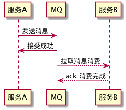
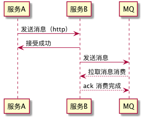

# klg-mq-koa
rabbitmq 中间件 for koa，方便把异步接口快速接入 MQ。

## Koa 服务与 MQ 服务的连接方式
消息队列（Message queue）一般被我们用来做服务间通信，在发送方和消费方的速率不对等的时候，MQ 起到了缓冲的作用。
一般情况下，我们是这样接入 MQ 的

见 normal.puml




这样需要服务A B 两边都对接 MQ，为了简化接入流程，我们更倾向于使用这样方式对接

见 actual.puml



这种方式的好处的，只要服务B 对接 MQ ，而且原有服务 A B 直接的 http 连接方式不需要做任何修改

## QuickStart

原接口：

```js
router.post('/user/:userId', endPoint)
```

接入 MQ:

```js
const mq = new KoaRabbitmq('amqp://joda:5672', 'test') // test 是 mq channel 前缀，用于区分不同服务
router.post('/user/:userId', mq.queue(endPoint, {prefetch: 2}))  // prefetch 表示消费速率
```

### Test

```bash
$ npm i
$ npm test
```

